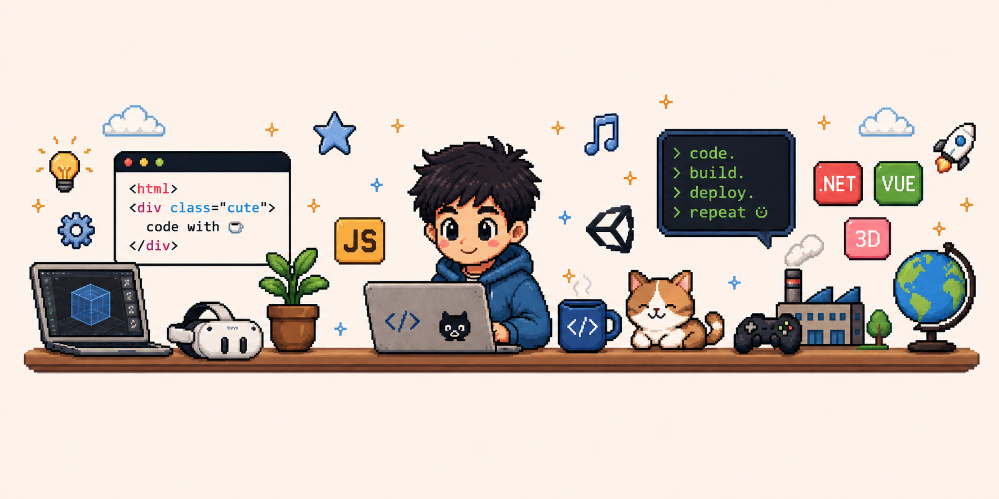

 

### 🌊 **Ricardo Espinosa** 🌊

 

🔗   **Desarrollador Fullstack | 3D & XR** · Ingeniería con enfoque humano · Amante del código limpio y los sistemas bien pensados

 

 

**Frontend & UX**

 

**Backend & Datos**

 

**3D · XR · IoT**

 

**DevOps & Herramientas**

 

📍 León, México · ✉️ ricardoaet22@gmail.com

